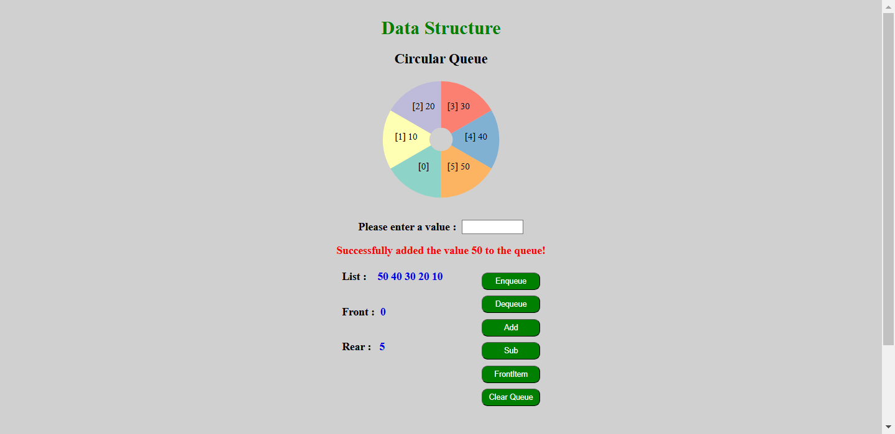
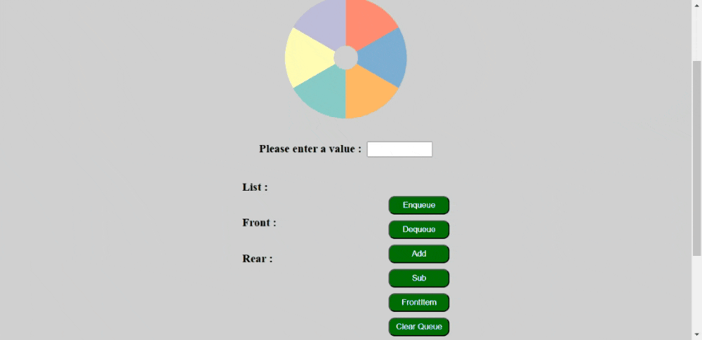
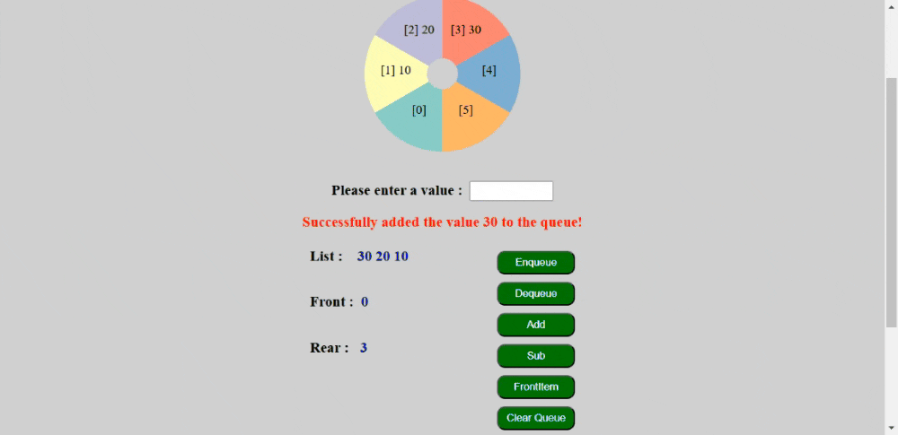
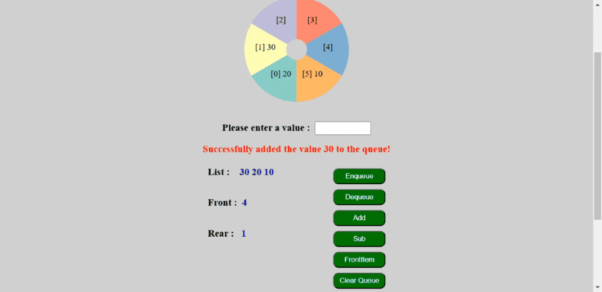
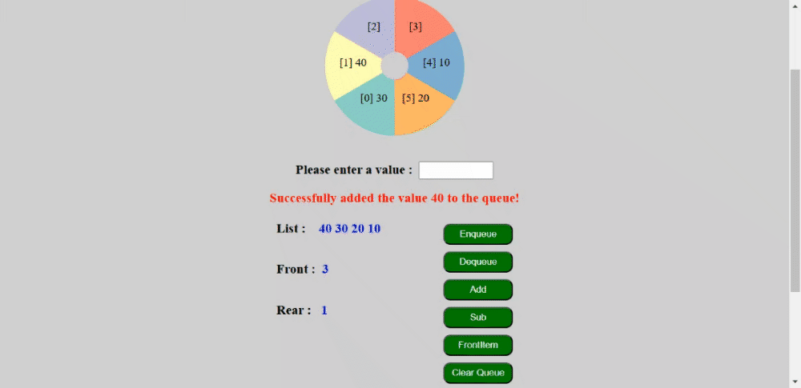
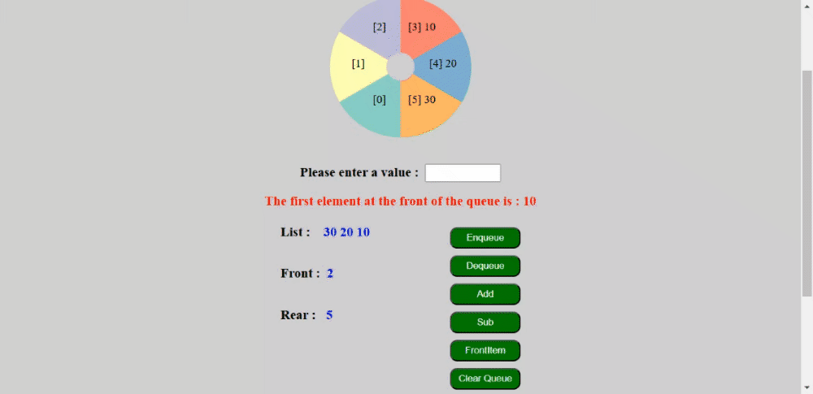

# Circular Queue
- Website [Click Here](https://chocolate99999.github.io/CircularQueue/)



## Description

This project demonstrates the implementation and visualization of a **Circular Queue**. It allows users to:

- Add elements to the queue.
- Remove elements from the queue.
- Display the current state of the queue.
- Visualize the queue data on a donut chart.

The application is built using **HTML**, **CSS**, and **JavaScript**, and leverages the **D3.js** library for data visualization.

## Features

- **Dynamic Queue Operations**: Add and remove elements with visual feedback.
- **Donut Chart Visualization**: Displays the queue data as a dynamic donut chart using **D3.js**.
- **Interactive UI**: Easily interact with the queue through an intuitive interface.

## Project Structure

```
CircularQueue/
├── .git/              # Version control folder
├── app.js             # Main JavaScript file
├── index.html         # Entry HTML file
├── styles/            # Folder containing stylesheets
├── README.md          # Project documentation

```

## Installation

1. Clone the repository:
    
    ```bash
    git clone <repository-url>
    
    ```
    
2. Navigate to the project directory:
    
    ```bash
    cd CircularQueue
    
    ```
    
3. Open `index.html` in your browser to view the application.

## Usage

### Enqueue

1. Enter a value into the input field.
2. Click the "Enqueue" button to enqueue the value.
    
    
    

### Dequeue

1. Click the "dequeue " button to dequeue the value from the front of the queue.
    
### Add

- Click the "Add" button to retrieves the first two values from the queue, adds them together, and enqueues the result at the rear of the queue
    
    
    

### Sub

- Click the "Sub" button to retrieves the first two values from the queue, subtracts them, and enqueues the result at the rear of the queue.
    
    
    

### FrontItem

- Click the "FrontItem" button to returns the first element currently holding a value in the queue.
    
    
    

### Clear Queue

- Click the "Clear Queue" button to reset the queue.
    
    
    

## How It Works

1. **Enqueue Operation**:
    - Adds an element to the position indicated by the `Rear` index.
    - Updates the visualization.
2. **Dequeue Operation**:
    - Removes an element from the position indicated by the `Front` index.
    - Updates the visualization.
3. **Visualization**:  
    - Data is rendered on a donut chart using **D3.js**, showing the queue's current state.  

## Limitations

- The queue size is fixed; ensure you adjust the size in the code if necessary.
- The chart does not render `null` or empty values.
